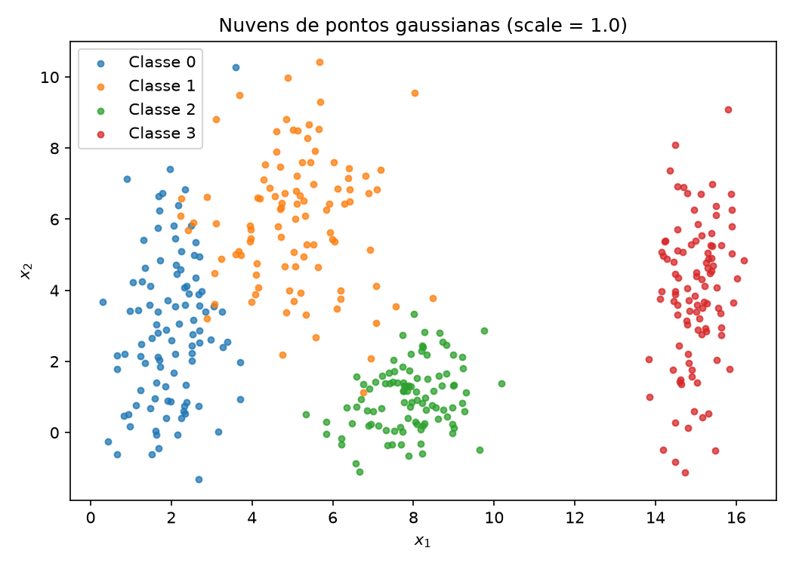
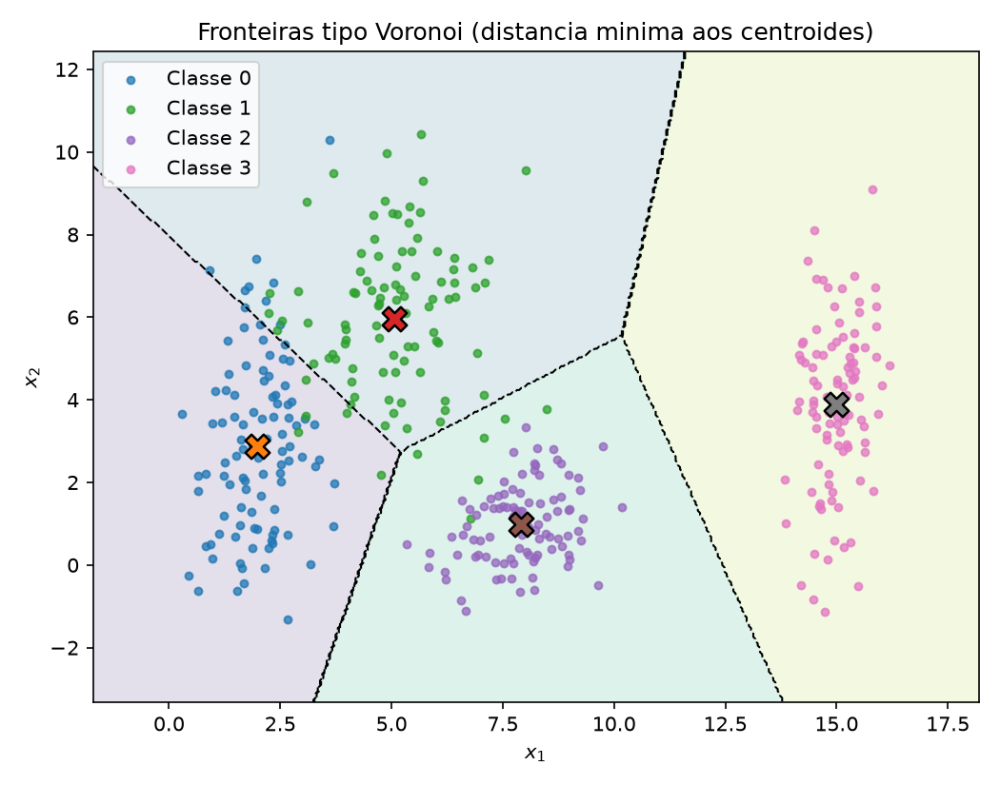
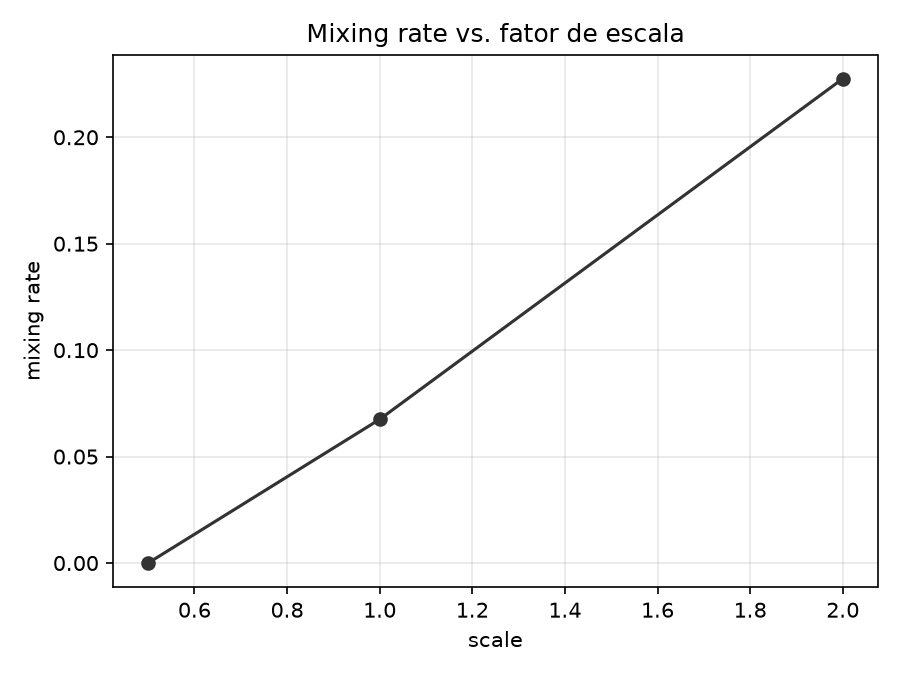
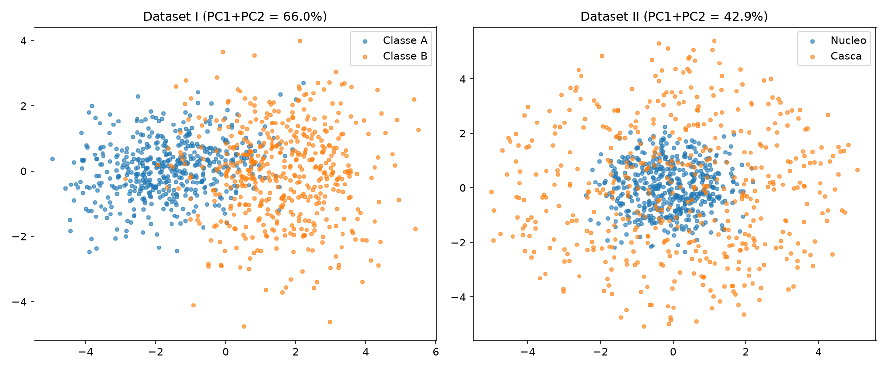
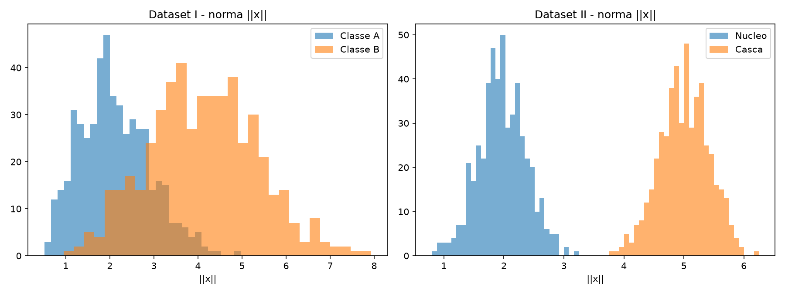
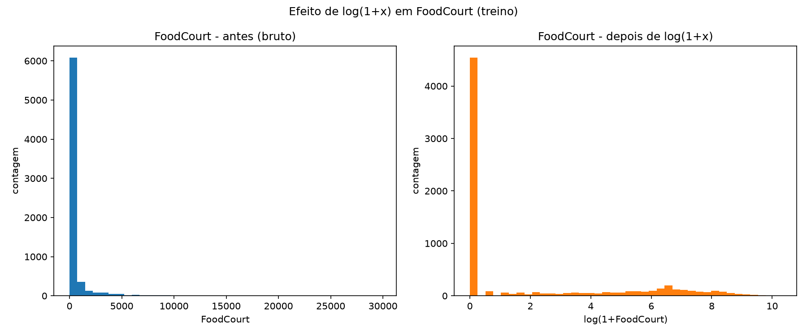
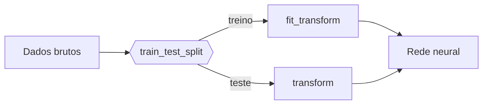

# 1. Data

!!! abstract "Enunciado"

    [Exercises → Data](https://insper.github.io/ann-dl/2026.2/exercises/data/){:target='_blank'}

## Exercise 1

### Abordagem

Foram geradas 4 nuvens gaussianas em 2D (100 pontos cada, `rng = np.random.default_rng(42)`), usando as médias e desvios padrão do enunciado. O mesmo gerador é reaproveitado entre as três reamostragens em diferentes escalas (`scale ∈ {0.5, 1.0, 2.0}`), multiplicando apenas os desvios padrão — as médias nunca mudam. Duas métricas geométricas (sem treinar nenhum modelo) resumem a separabilidade: um **separation ratio** agregado (distância média entre centroides dividida pela dispersão média intraclasse) e uma **mixing rate** (fração de pontos cujo centroide mais próximo não é o da própria classe).

### Código

O script vive em [`code/exercise1_point_clouds.py`](code/exercise1_point_clouds.py) e é incluído aqui pelo próprio arquivo.

``` { .python .copy .select linenums='1' title="docs/exercises/data/code/exercise1_point_clouds.py" }
--8<-- "docs/exercises/data/code/exercise1_point_clouds.py"
```

1.  Semente fixa: sem ela, os números da tabela de resultados mudam a cada execução e a correção não consegue reproduzir o relatório.
2.  `plt.close(fig)` evita o vazamento de figuras quando o script gera várias em sequência.

### Figuras


/// caption
**Figura 1** — Dispersão das quatro classes no plano $(x_1, x_2)$ com `scale = 1.0`. Os "X" marcam os centroides.
///


/// caption
**Figura 1b** — Mesma nuvem, com as regiões de decisão de um classificador de distância mínima aos centroides sobrepostas (aproximação geométrica da fronteira que uma rede aprenderia).
///


/// caption
**Figura 1c** — Mixing rate cresce com `scale`; o salto mais expressivo ocorre entre `scale = 1.0` e `scale = 2.0`.
///

### Análise

Em `scale = 0.5` o separation ratio é **8.95** e a mixing rate é **0.0000** — as nuvens praticamente não se tocam. Em `scale = 1.0` o separation ratio cai para **4.59** e a mixing rate sobe para **0.0675** (6.75%), sobreposição concentrada quase toda entre as classes 0 e 1 (as mais próximas entre si, olhando a Figura 1). O salto qualitativo acontece entre `scale = 1.0` e `scale = 2.0`: o separation ratio cai pela metade (**2.22**) e a mixing rate mais que triplica (**0.2275**, 22.75%) — é a partir daí que uma única reta deixa de conseguir separar bem as classes 0 e 1.

Nenhuma reta única separa as 4 classes simultaneamente (uma reta só corta o plano em 2 partes), mas um **conjunto** de fronteiras lineares (Figura 1b, equivalente a um diagrama de Voronoi dos centroides) separa razoavelmente bem as 4 classes em `scale = 1.0`, errando só na faixa de sobreposição entre 0 e 1. Uma MLP real aprenderia algo parecido com essas fronteiras retas, com uma leve curvatura suavizada exatamente nessa faixa de sobreposição.

Quanto mais espalhadas as nuvens ficam, maior a região onde erros são inevitáveis: gaussianas têm cauda infinita, então nunca existe separação "perfeita", só mais ou menos provável. Isso é exatamente o que a Figura 1c mede — o erro mínimo possível (erro de Bayes) cresce junto com o spread.

## Exercise 2

### Abordagem

Dois datasets 5D de 500 amostras por classe: **Dataset I**, duas gaussianas multivariadas deslocadas (`rng.multivariate_normal`, médias e covariâncias diferentes); **Dataset II**, duas "cascas" concêntricas — direções sorteadas uniformemente na esfera unitária de ℝ⁵, com raio gaussiano diferente por classe (~2 para o núcleo, ~5 para a casca), mesmo centro teórico. Ambos são projetados para 2D via PCA para comparação visual.

### Código

O script vive em [`code/exercise2_non_linearity.py`](code/exercise2_non_linearity.py).

``` { .python .copy .select linenums='1' title="docs/exercises/data/code/exercise2_non_linearity.py" }
--8<-- "docs/exercises/data/code/exercise2_non_linearity.py"
```

### Figuras


/// caption
**Figura 2** — Projeção PCA (5D → 2D) do Dataset I (esquerda) e do Dataset II (direita).
///


/// caption
**Figura 2b** — Histograma da norma $\lVert x \rVert$ por classe, calculada em 5D.
///

### Análise

**Dataset I:** distância entre centros = **3.3541**; variância explicada por PC1+PC2 = **65.97%** — a PCA já captura boa parte da estrutura, e a Figura 2 (esquerda) mostra as classes parcialmente separadas mesmo em 2D.

**Dataset II:** distância entre centros = **0.2662** (praticamente zero — os centros teóricos coincidem); variância explicada por PC1+PC2 = **42.91%**; raio médio do núcleo = **1.97**, raio médio da casca = **5.00**. A PCA "falha" aqui: captura menos variância e mistura totalmente as classes (Figura 2, direita), porque a estrutura relevante (o raio) está distribuída simetricamente em **todas** as direções, não numa direção privilegiada de maior variância.

!!! note "Fronteiras não lineares"

    Um separador linear é
    $$ f(\mathbf{x}) = \mathbf{w}^\top \mathbf{x} + b, $$
    enquanto a estrutura das cascas depende de $\lVert \mathbf{x} - \boldsymbol{\mu} \rVert$, que não é expressável nessa forma. Como a direção de cada ponto é sorteada de forma independente da classe, qualquer projeção linear $\mathbf{w}^\top \mathbf{x}$ tem, em expectativa, a mesma média para as duas classes — nenhum hiperplano separa essas classes, por mais dados que se colete.

    Prova concreta: a função $g(\mathbf{x}) = \lVert \mathbf{x} \rVert^2 = \sum_i x_i^2$, com um limiar no ponto médio entre os quadrados dos raios médios (≈ 14.47), classifica corretamente **99.9%** dos 1000 pontos do Dataset II — mesmo a PCA linear mostrando as classes totalmente sobrepostas. Uma projeção PCA "misturada" não é prova de inseparabilidade: é só prova de que aquela transformação **linear** específica não capturou a estrutura **não-linear** (radial) que de fato separa as classes.

## Exercise 3

### Abordagem

Dataset real: [Spaceship Titanic (Kaggle)](https://www.kaggle.com/competitions/spaceship-titanic), `train.csv` (8693 linhas, 14 colunas). Pipeline: split treino/teste estratificado **antes** de qualquer estatística, imputação (mediana para numéricas, moda para categóricas) ajustada só no treino, engenharia de `TotalSpend`, `log(1+x)` nas colunas de gasto (cauda pesada), one-hot encoding com `handle_unknown="ignore"`, e padronização apenas das colunas numéricas contínuas — deixando as dummies binárias fora da padronização (ver Análise).

### Código

O script vive em [`code/exercise3_spaceship_titanic.py`](code/exercise3_spaceship_titanic.py).

``` { .python .copy .select linenums='1' title="docs/exercises/data/code/exercise3_spaceship_titanic.py" }
--8<-- "docs/exercises/data/code/exercise3_spaceship_titanic.py"
```

### Figuras


/// caption
**Figura 3** — Distribuição de `FoodCourt` (treino) antes e depois de `log(1+x)`.
///

### Análise

`Transported` é aproximadamente balanceada (50.36% / 49.64%). Todas as 5 colunas de gasto têm **mediana zero** e média bem positiva (ex.: `FoodCourt`: média 458.08, mediana 0.0, máximo 29813) — a maioria dos passageiros não gasta nada, uma pequena fração gasta valores extremos (skewness entre 6.3 e 12.6). É esse padrão que justifica o `log(1+x)`: sem ele, esses outliers, já padronizados, saturariam uma ativação `tanh` (`tanh(z) ≈ ±1` e derivada `≈ 0` para `|z|` grande), matando o gradiente exatamente nos exemplos mais extremos.

12 das 14 colunas originais têm valores ausentes, todas numa faixa estreita (~2–2.5%), sem nenhuma dominando — padrão consistente com dados faltando de forma aproximadamente aleatória.

!!! warning "Vazamento de dados"

    O `train_test_split` vem **antes** de qualquer imputação, encoding ou escalonamento. Os transformadores são ajustados (`fit`) só no treino e aplicados (`transform`) também ao teste — se as estatísticas fossem calculadas no dataset inteiro antes de separar, informação da distribuição do teste vazaria indiretamente para o treino, inflando artificialmente o desempenho reportado.



**Erro detectado e corrigido:** a primeira versão da padronização aplicou `StandardScaler` a *todas* as colunas, inclusive as dummies 0/1 do one-hot. Resultado: intervalo final de **[-6.54, 6.54]**, porque categorias raras (ex. `VIP=True`, ~2% das linhas) têm desvio padrão pequeno, e padronizar uma coluna binária rara transforma o valor 1 num z-score enorme. Corrigido para padronizar só as colunas numéricas contínuas, o intervalo caiu para **[-2.00, 3.51]** — muito mais compatível com a região não-saturada da `tanh`.

## Results summary

| # | Métrica | Valor |
|---|---------|-------|
| 1 | Separation ratio (`scale = 0.5`) | 8.9510 |
| 2 | Separation ratio (`scale = 1.0`) | 4.5857 |
| 3 | Separation ratio (`scale = 2.0`) | 2.2206 |
| 4 | Taxa de mistura (`scale = 1.0`) | 0.0675 |
| 5 | Distância entre centros — gaussianas 5D | 3.3541 |
| 6 | Variância explicada — PC1 + PC2 | 65.97% (Dataset I) / 42.91% (Dataset II) |
| 7 | Raio médio — casca interna | 1.9718 |
| 8 | Raio médio — casca externa | 5.0047 |
| 9 | Amostras de treino após o split | 6954 |
| 10 | Amostras de teste após o split | 1739 |
| 11 | Colunas com valores ausentes | 12 (de 14) |
| 12 | Features após o encoding | 17 |
| 13 | Faixa das features após o escalonamento | [-2.00, 3.51] (treino) / [-2.00, 3.37] (teste) |

> Nota sobre a linha 6: o enunciado do template não deixa explícito a qual dos dois datasets do Exercise 2 essa linha se refere — reportei os dois valores para não haver ambiguidade na correção.

## Discussão

A parte mais contraintuitiva foi o Dataset II do Exercise 2: a primeira reação ao ver a PCA totalmente misturada (Figura 2, direita) foi supor que as classes fossem inseparáveis — o que é falso. A intuição só "clicou" ao plotar o histograma de raios (Figura 2b) e perceber que a separação existe, só que numa característica não-linear (norma) que uma projeção linear não consegue capturar. Isso mudou como eu leio qualquer redução de dimensionalidade linear a partir de agora: ausência de separação visível não é prova de inseparabilidade.

A decisão que eu tomaria diferente: no Exercise 3, eu padronizei inicialmente todas as colunas (inclusive as one-hot) sem pensar — um erro que só apareceu porque o intervalo final ficou estranhamente largo ([-6.54, 6.54]). Da próxima vez eu inspecionaria o `min`/`max` esperado de cada tipo de coluna *antes* de escalonar, não depois.

## Conclusão

Os três exercícios mostram a mesma ideia por ângulos diferentes: a dificuldade de uma fronteira de decisão não depende só de quão "longe" as classes estão, mas de quão longe elas estão **em relação à sua própria dispersão** (Exercise 1), e depende do tipo de estrutura geométrica em jogo — direcional (linearmente separável) vs. radial (exige uma função não-linear, Exercise 2). No mundo real (Exercise 3) essas ideias viram decisões concretas de pré-processamento: outliers e caudas pesadas não são só "sujeira" nos dados, são exatamente o tipo de estrutura que pode saturar uma ativação como `tanh` e impedir a rede de aprender com os exemplos mais extremos — tratar isso bem, antes de qualquer treino, é parte do trabalho de tornar um problema realmente aprendível por uma rede neural.
