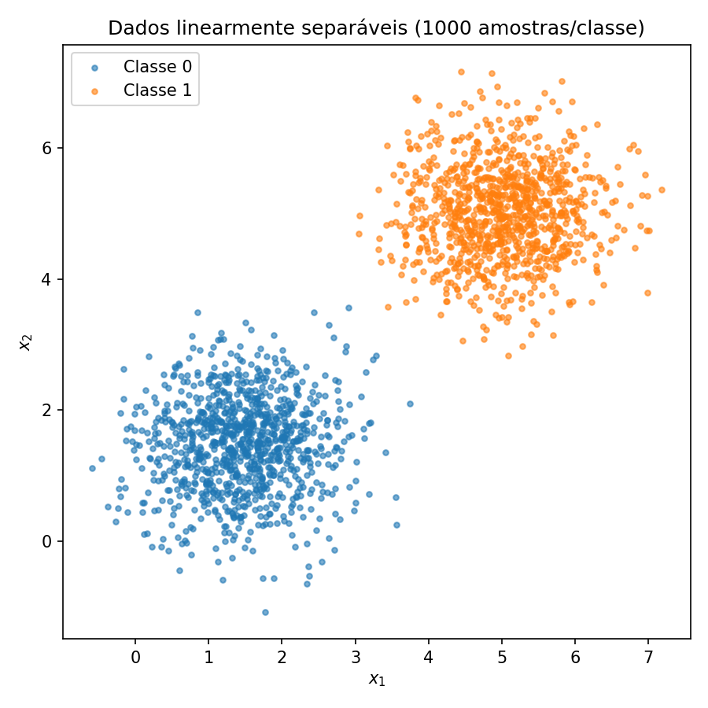
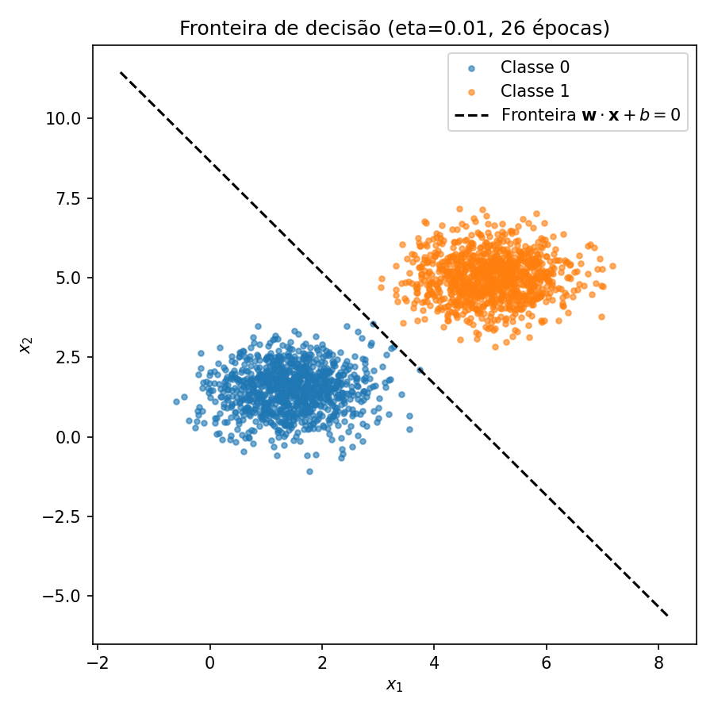
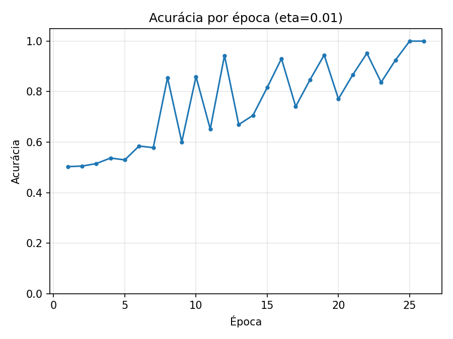
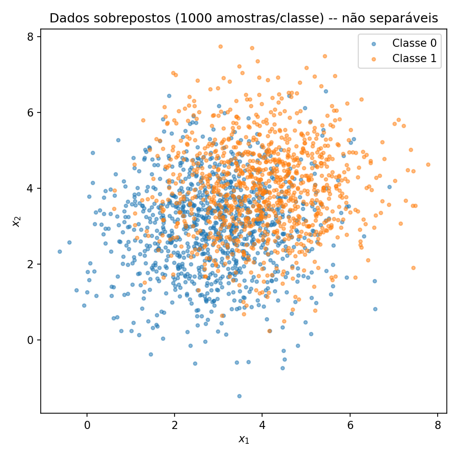
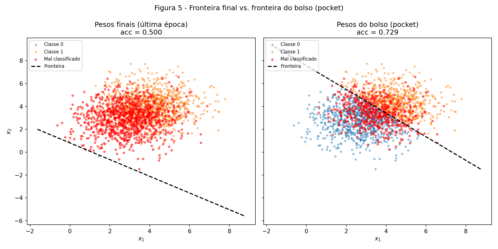
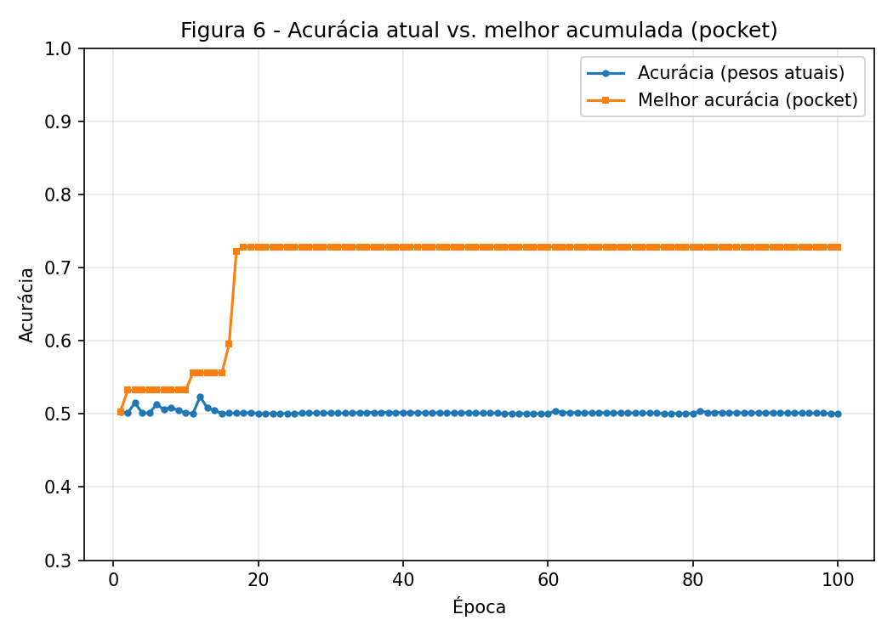

exercise: perceptron
ai_use: "Claude foi usado para escrever a implementação do perceptron e dos dois scripts de experimento a partir do enunciado, e para redigir a primeira versão das análises. Eu executei os scripts localmente, testei, corrigi alguns erros no código e aprofundei a análise do conteúdo antes de considerar o relatório pronto."
---

# 2. Perceptron

!!! abstract "Enunciado"

    [Exercises → Perceptron](https://insper.github.io/ann-dl/2026.2/exercises/perceptron/){:target='_blank'}

## Exercise 1

### Abordagem

Foram geradas 1000 amostras por classe a partir de duas gaussianas 2D bem separadas
(classe 0: média `[1.5, 1.5]`; classe 1: média `[5, 5]`; ambas com covariância `0.5·I`),
usando `numpy.random.default_rng(42)` para reprodutibilidade. O perceptron (`perceptron.py`)
implementa a regra de atualização orientada a erro para rótulos `{0,1}`:

$$
\hat{y} = \text{step}(\mathbf{w}\cdot\mathbf{x}+b), \qquad
\mathbf{w} \leftarrow \mathbf{w} + \eta(y-\hat{y})\mathbf{x}, \qquad
b \leftarrow b + \eta(y-\hat{y})
$$

Os pesos iniciais **não** partem de zero: `w ~ N(0, 0.01)`, `b = 0`, sorteados uma única vez
do mesmo gerador usado para os dados, e reaproveitados nos dois treinos (itens C e D2) para
que `eta` seja a única variável que muda entre eles. O treino para quando uma época inteira
não produz nenhuma atualização, ou após 100 épocas.

### Código

O perceptron em si (usado sem alterações também no Exercício 2):

``` { .python .copy .select linenums='1' title="docs/exercises/perceptron/code/perceptron.py" }
--8<-- "docs/exercises/perceptron/code/perceptron.py"
```

Geração dos dados, treino com `eta=0.01` e `eta=1.0`, e figuras:

``` { .python .copy .select linenums='1' title="docs/exercises/perceptron/code/exercise1_perceptron.py" }
--8<-- "docs/exercises/perceptron/code/exercise1_perceptron.py"
```

1. `on_update` é um *hook* opcional: o Exercício 1 não o usa, o Exercício 2 o usa para
   implementar o *pocket algorithm* sem tocar no laço de treino.
2. Os pesos iniciais são sorteados uma única vez e reaproveitados nos dois valores de `eta`,
   para isolar o efeito da taxa de aprendizado (item D2).

### Figuras


/// caption
**Figura 1** — Duas classes gaussianas bem separadas (1000 amostras/classe).
///


/// caption
**Figura 2** — Fronteira final com `eta=0.01`, sem nenhum ponto mal classificado.
///


/// caption
**Figura 3** — Acurácia por época (`eta=0.01`): convergência para 100% em 26 épocas.
///

### Análise

**A/C — Treino com `eta=0.01`.** O perceptron converge em **26 épocas**, com pesos finais
`w = [0.0505, 0.0289]`, `b = -0.250`, atingindo **100% de acurácia** (Figuras 2 e 3). Isso é
esperado pelo teorema de convergência do perceptron: como os dados são linearmente
separáveis por construção (médias distantes, variância pequena), o algoritmo é garantido a
encontrar uma fronteira sem erros em um número finito de passos.

**D1 — Por que a inicialização não pode ser `w=0`.** Partindo de `w=0, b=0`, a primeira
atualização de qualquer amostra mal classificada é `w ← 0 + η(y-ŷ)x = η(y-ŷ)x`, ou seja, o
primeiro vetor de pesos é **sempre um múltiplo escalar de `η`** vezes a mesma direção `x`,
qualquer que seja o valor de `η`. De modo mais geral, se todo o histórico de atualizações a
partir de `w=0` for `w_T = η·Σ(yᵢ-ŷᵢ)xᵢ`, então `η` aparece apenas como um fator multiplicativo
global em `w` (e em `b`). Como a classificação depende só do **sinal** de `w·x+b`, e
multiplicar toda a fronteira por uma constante positiva não muda esse sinal em nenhum ponto,
a sequência de acertos/erros — e portanto o número de épocas até convergir — seria
**idêntica para qualquer `η>0`**. É por isso que o enunciado pede pesos iniciais não nulos
(`w ~ N(0, 0.01)`): só assim `η` passa a interagir de fato com uma direção inicial que não é
puramente definida por ele mesmo, tornando seu efeito observável (ver item D2 abaixo).

**D2 — Efeito de `eta=1.0` (mesmos `w0,b0`).** Com `eta=1.0` o treino converge em
**37 épocas**, com pesos finais `w = [5.8706, 3.3592]`, `b = -31.000`, também com
**100% de acurácia**. A direção da fronteira (`w/‖w‖`) é praticamente **idêntica** entre os
dois `eta` — a similaridade de cosseno entre as duas direções é **1.000000** — porque ambos
os conjuntos de atualizações são compostos pelos mesmos vetores `x` na mesma ordem relativa,
apenas escalados por `η`. O que muda é a **posição** da fronteira: a distância perpendicular
à origem, `|b|/‖w‖`, é **4.298** para `eta=0.01` e **4.583** para `eta=1.0`, contra
**4.596** do ponto médio geométrico entre as duas médias das classes (`[3.25, 3.25]`,
distância `3.25√2 ≈ 4.596` da origem). Ou seja, `eta=1.0` termina mais próximo da margem
"ideal" entre as classes, enquanto `eta=0.01` para assim que encontra qualquer separador
válido, sem se aproximar tanto do meio-termo — um efeito indireto de `eta` sobre *onde*
dentro da região de separadores válidos o treino se estabiliza, mesmo com a direção quase
inalterada. Isso também explica por que precisou de mais épocas (37 > 26): passos maiores
tendem a "ultrapassar" e corrigir novamente antes de zerar as atualizações.

## Exercise 2

### Abordagem

Mesma estrutura do Exercício 1, mas com as duas gaussianas sobrepostas (classe 0: média
`[3,3]`; classe 1: média `[4,4]`; ambas com covariância `1.5·I`), tornando os dados **não
linearmente separáveis** por construção. O `perceptron.py` é reutilizado **sem nenhuma
alteração**; a única adição é o *pocket algorithm*, implementado inteiramente através do
callback `on_update(w, b, epoch, acc)` — a cada atualização, se a acurácia no conjunto
completo melhorar em relação ao melhor valor já visto, os pesos "do bolso" são substituídos.
O laço de treino em si não sabe que o pocket existe.

### Código

``` { .python .copy .select linenums='1' title="docs/exercises/perceptron/code/exercise2_perceptron.py" }
--8<-- "docs/exercises/perceptron/code/exercise2_perceptron.py"
```

1. `pocket` é um dicionário fechado sobre `track_pocket`, evitado o uso de variáveis globais.
2. `pocket_curve_per_update` guarda um ponto por atualização; a curva por época (Figura 6) é
   obtida reamostrando essa lista, sem rodar um segundo treino.

### Figuras


/// caption
**Figura 4** — Duas classes gaussianas sobrepostas (1000 amostras/classe), sem separação
linear visível.
///


/// caption
**Figura 5** — Fronteira dos pesos finais (100ª época, acc=0.500, essencialmente aleatória)
vs. fronteira dos pesos do bolso (acc=0.729, a melhor encontrada durante o treino).
///


/// caption
**Figura 6** — Acurácia dos pesos correntes (oscila em torno de 50%, nunca converge) vs.
melhor acurácia acumulada pelo pocket (sobe em degraus e estabiliza em ~73%).
///

### Análise

**A/B — Treino sem early stop.** Como esperado, o treino roda as **100 épocas completas**
sem nunca zerar as atualizações em uma época — os dados não são separáveis, então sempre há
algum ponto mal classificado a cada passada. Os pesos finais (`w = [0.0361, 0.0494]`,
`b = -0.040`) atingem apenas **50.05%** de acurácia, essencialmente o nível de um chute
aleatório entre duas classes balanceadas (Figura 5, painel esquerdo — quase todos os pontos
aparecem marcados como mal classificados).

**D1 — Pocket vs. pesos finais.** O algoritmo do bolso encontrou, na **época 18**, os pesos
`w = [0.0068, 0.0066]`, `b = -0.050`, que classificam corretamente **72.85%** dos pontos —
próximo do valor citado no enunciado (~73%) como o melhor que uma fronteira linear consegue
fazer nessa distribuição. A norma média dos vetores de entrada medida nos dados,
`‖x‖ ≈ 5.069`, confere com a dica do enunciado (`‖x‖≈5`): mesmo com atualizações da ordem de
`η·‖x‖ ≈ 0.05` por passo, os pesos finais oscilam sem nunca se estabilizar (Figura 6, curva
azul), porque a cada época o conjunto de pontos mal classificados muda — não existe um
estado de "zero erros" para o treino convergir. O pocket resolve isso guardando o melhor
resultado já visto, em vez de usar o estado do último passo.

**D2 — Por que o perceptron não converge aqui.** O teorema de convergência do perceptron
garante um número finito de atualizações **somente quando os dados são linearmente
separáveis** — é essa hipótese que a demonstração usa para limitar a margem geométrica entre
as classes por baixo. Como as duas gaussianas do Exercício 2 têm médias próximas (`[3,3]` e
`[4,4]`) e covariância grande (`1.5·I`), suas distribuições se sobrepõem, então **nenhuma**
reta separa as duas classes sem erro: qualquer fronteira comete erro em uma fração não nula
dos pontos, e a regra de atualização nunca chega a uma passada com zero correções. A
premissa que o teorema exige está, de propósito, violada neste exercício.

**D3 — Mais épocas ou `eta` menor não resolvem.** Rodar mais épocas (acima das 100 usadas)
não ajuda: a Figura 6 mostra a acurácia dos pesos correntes já estabilizada em torno de 50%
desde cedo, oscilando indefinidamente — não há tendência de queda nem de subida, porque a
cada época o conjunto de erros muda mas continua com tamanho semelhante. Isso é uma
consequência direta da regra `w ← w + η(y-ŷ)x`: como sempre existe pelo menos um ponto mal
classificado (dado não separável), sempre haverá pelo menos uma atualização por época, então
o critério de parada (`n_updates == 0`) nunca é satisfeito — o algoritmo literalmente não
tem para onde convergir. Diminuir `η` também não ajuda: mesmo com pesos iniciais não nulos, `η` continua controlando
apenas o **tamanho** de cada passo de atualização, não a existência de pontos mal
classificados; ele muda a velocidade com que os pesos se movem, mas não faz o conjunto de
pontos sobrepostos deixar de existir. O único jeito de melhorar o resultado é abandonar a ideia de "pesos finais" e usar
o **pocket**, que já recupera a melhor fronteira linear possível (~73%) dentro do
treinamento — o limite não é do algoritmo, é da hipótese de separabilidade linear dos dados.

## Results summary

| # | Métrica | Valor |
|---|---------|-------|
| 1 | Épocas até convergência (`eta=0.01`, Exercício 1) | 26 |
| 2 | Acurácia final (`eta=0.01`, Exercício 1) | 1.0000 |
| 3 | Épocas até convergência (`eta=1.0`, Exercício 1) | 37 |
| 4 | Acurácia final (`eta=1.0`, Exercício 1) | 1.0000 |
| 5 | Similaridade de cosseno entre direções (`eta=0.01` vs `eta=1.0`) | 1.000000 |
| 6 | Distância fronteira–origem `\|b\|/‖w‖` (`eta=0.01`) | 4.298 |
| 7 | Distância fronteira–origem `\|b\|/‖w‖` (`eta=1.0`) | 4.583 |
| 8 | Distância origem–ponto médio entre classes | 4.596 |
| 9 | Épocas rodadas (Exercício 2, sem convergir) | 100 |
| 10 | Acurácia final (pesos da última época, Exercício 2) | 0.5005 |
| 11 | Acurácia do pocket (melhor encontrada, Exercício 2) | 0.7285 |
| 12 | Época em que o pocket encontrou seu melhor resultado | 18 |
| 13 | Norma média `‖x‖` dos dados do Exercício 2 | 5.069 |

## Discussão

A parte mais reveladora do exercício foi ver, numericamente, que `eta` quase não afeta a
**direção** da fronteira quando os pesos iniciais não são nulos (cosseno ≈ 1), mas afeta sua
**posição** e o número de épocas — um efeito mais sutil do que "learning rate maior = pior"
ou "menor = melhor". No Exercício 2, o ponto que mais chamou atenção foi constatar que o
pocket não é uma técnica que "conserta" o perceptron: ele não muda a regra de atualização em
nada, apenas guarda o melhor estado já visitado durante uma busca que nunca vai parar
sozinha. Isso deixou mais claro por que a separabilidade linear é uma hipótese do teorema de
convergência, e não um detalhe de implementação.

## Conclusão

Os dois exercícios mostram, de forma complementar, a fronteira exata da capacidade de um
perceptron de camada única: quando os dados são linearmente separáveis, ele converge de
forma garantida e rápida para uma fronteira com 100% de acurácia, e a taxa de aprendizado
influencia principalmente a posição final e a velocidade de convergência, não a
possibilidade de convergir. Quando essa hipótese é violada, como no Exercício 2, nenhum
ajuste de hiperparâmetros (mais épocas, `eta` menor) resolve o problema, porque a limitação
é geométrica, não numérica — só uma fronteira não linear, ou uma estratégia diferente
(pocket, ou um modelo mais expressivo), consegue lidar com dados sobrepostos.
