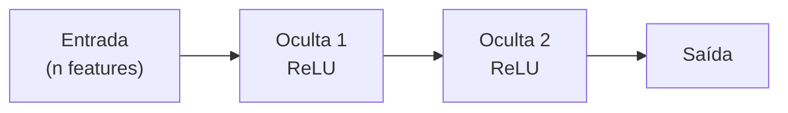

# Projeto — Regressão

!!! abstract "Enunciado"

    [Projects · Regressão :material-open-in-new:](https://insper.github.io/ann-dl/2026.2/projects/regression/){:target='_blank'}

!!! info "Equipe"

    | Nome | GitHub |
    |------|--------|
    | | |
    | | |

## 1. Escolha do dataset

Nome, URL da fonte, número de amostras e de features, e **por que** este dataset.

## 2. Descrição do dataset

Features, variável alvo, contexto do domínio e problemas identificados (ausências,
desbalanceamento, escalas heterogêneas, vazamento potencial).

## 3. Limpeza e normalização

## 4. Implementação da MLP

Arquitetura, funções de ativação, função de perda e otimizador — com a justificativa de
cada escolha.

## 5. Treinamento

Loop de treino, hiperparâmetros e as dificuldades enfrentadas.

## 6. Estratégia de treino e teste

Proporções do split, validação e como o *overfitting* foi contido.

## 7. Curvas de erro

/// caption
**Figura 1** — Perda de treino e de validação por época.
///

## 8. Métricas de avaliação

| Métrica | Treino | Validação | Teste |
|---------|--------|-----------|-------|
| | | | |

Compare com um *baseline* simples e discuta o resultado.

## Conclusão

Principais achados, limitações e o que faria a seguir.

## Referências
